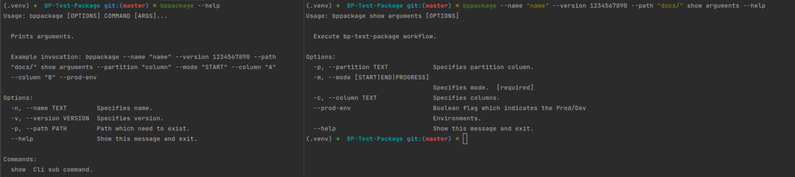
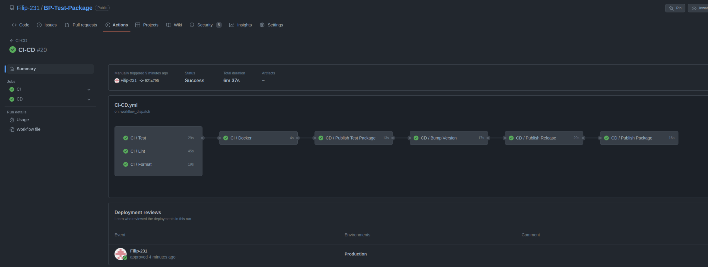
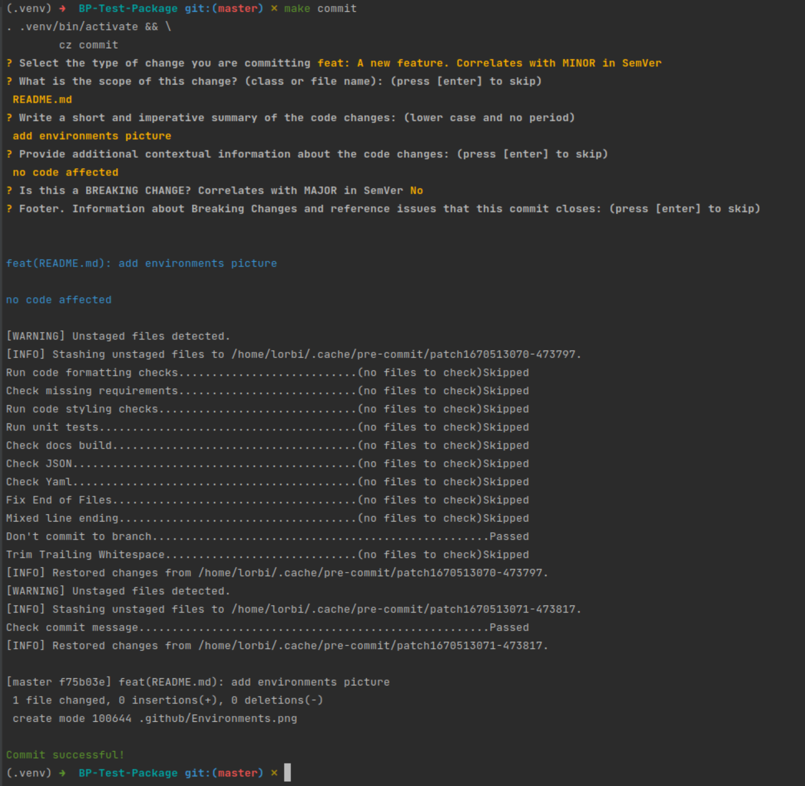
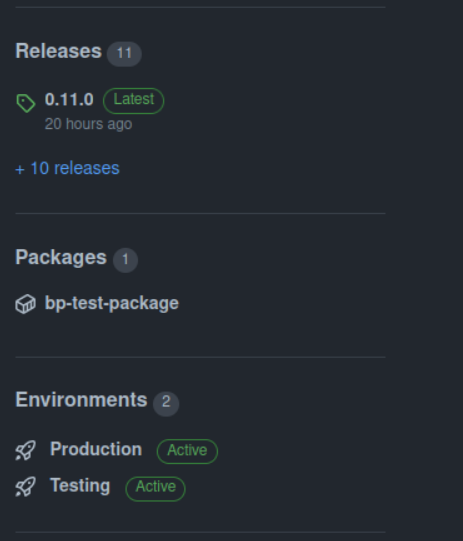

# BP-Test-Package
This is an example repository created directly from a **package** template.  
This repository is a comprehensive example of lightweight dummy cli tool which can be shared between multiply apps.
***
### Local environment
Create **.env** file:

| **Variable**              | **Description**            | **Value**       |
|---------------------------|----------------------------|-----------------|
| _PROJECT                  | Project name               | BP-Test-Package |
| _USER                     | User name                  | Filip-231       |

Install all necessary packages: `make install`.
Activate virtual environment `. .venv/bin/activate` and now you can use this package.

### Command line interface:
```
bppackage [--help] <--name (-o) NAME> <--version (-v) 1234567890> [--path -(p) PATH] show arguments [--partition (-p) column] <--mode (-m) MODE> [--column (-c) column_A] [--prod-env]
```
 `<>` sign means mandatory and `[]` sign means optional.
Options have long and short form: `-n` is the same as `--name`.




***
## Repository secrets
Navigate to GitHub Actions secrets [tab](https://github.com/Filip-231/BP-Test-Django/settings/secrets/actions).

| **Variable**               | **Description**                                                                                                 | **Example Value**                                  |
|----------------------------|-----------------------------------------------------------------------------------------------------------------|----------------------------------------------------|
| PERSONAL_ACCESS_TOKEN      | PAT generated in GitHub developers menu, [token](https://github.com/settings/tokens) used to get package image  | ghp_ ........                                      |

***
## Features
After installing local environment `. .venv/bin/activate` and `make help` to see help message.
```
all                 commit and push all changes
brew-allure         install allure with brew long
build               build docker image
bump                (PART= ) bump the release version - deduced automatically from commit messages unless PART is provided
changelog           (UNRELEASED= current version) update the changelog incrementally.
check-commit        check the commit message is valid
clean               clean up temp and trash files
commit              make interactive conventional commit
docker-download-package (VERSION= ) download package from GH package registry
docker-run-package  (VERSION= ) runs package downloaded from GH package registry
docs                render documentation
down-volumes        remove docker images and volumes
format              format code
freeze              (UPGRADE= ) generate requirements from setup.cfg
get-version         output the current version
git                 reset git, specify new project and git user
help                display this help message
init                (LANGUAGE=django/tool/dbt) create cruft project and install pre-requirements
install             install all requirements
lint                run static code checkers
pre-install         install pre-requirements
release             create a new github release
set-project-name    (_PROJECT=project _USER=user ) set initial environment
tag                 pull tags and tag a new version
test                (ALLURE=True BROWSE=True) run tests
up                  (ARGS= ) run docker image
update-makefiles    update configuration files
update-project      update cruft project and install pre-requirements
update              update cruft project and configuration files
venv                install virtual environment
```
***
## Continuous Integration and delivery
Complete CI-CD process will be visible in GitHub Actions [page](https://github.com/Filip-231/BP-Test-Package/actions) containing:
* **CI** - run on every push to master and on pull requests:
  * **Test**  - run unit tests.
  * **Format** - check if code is formatted.
  * **Lint** - run all static code checkers with prospector.
  * **Docker** - build and up docker image.
* **CD** - continuous package delivery:
  * **Publish Test Package** - build docker bp-test-package-dev package with test and push to GitHub
  [packages](https://github.com/Filip-231?tab=packages&repo_name=BP-Test-Django).
  This package need to be reviewed after processing to the next step.
  * **Bump Version** - bump current version and push a tag to a repository.
  * **Publish Release** - publish new release to GitHub [releases](https://github.com/Filip-231/BP-Test-Django/releases).
  * **Publish Package** - build docker production package with version tag and push to GitHub [packages](https://github.com/Filip-231?tab=packages&repo_name=BP-Test-Django).
* **CI/CD** - manual trigger, includes CI and CD pipelines connected.

### CI/CD pipeline:



###Interactive commits:

<center>
<div style="width: 60%; height: 40%">



</div>
</center>

### Releases packages and environments:

<center>
<div style="width: 40%; height: 40%">



</div>
</center>

